(img-0.jpeg)

DIARIENR KS 2012.529

2015-11-26

# DETALJPLAN

PLANBESKRIVNING OCH GENOMFÖRANDEBESKRIVNING

Kristineberg, etapp 1

OMFATTANDE VALLENTUNA-RICKEBY 1:135,
VALLENTUNA-MÖRBY 1:297 M.FL. FASTIGHETER I
VALLENTUNA KOMMUN, STOCKHOLMS LÄN.

Samrådshandling

Vallentuna kommun

Arbetsmaterial

---

Arbetsmaterial

# 1.1 Innehåll

## Planbeskrivning
1

## 2. Planens syfte och huvuddrag
2

### 2.1 Planunderlag
2

## 3. Förenlighet med 3, 4 och 5 kap. miljöbalken
3

### 3.1 Riksintressen
3

### 3.2 Miljökvalitetsnormer
3

#### 3.2.1 Luft
3

#### 3.2.2 Vatten
3

## 4. Plandata
4

### 4.1 Läge och areal
4

### 4.2 Markägoförhållanden
5

## 5. Tidigare ställningstaganden
5

### 5.1 Översiktliga planer
5

### 5.2 Detaljplaner, förordnanden
6

### 5.3 Bostadsbyggnadsprognos 15A
6

### 5.4 Tidigare beslut
7

### 5.5 Program
7

## 6. Miljöbedömning/behovsbedömning
8

## 7. Förutsättningar och förändringar
8

### 7.1 Natur
8

SAMHÄLLSBYGGNADSFÖRVALTNINGEN
TUNA TORG 2, 2 TR - 186 86 VALLENTUNA
TFN 08-587 850 00 - FAX 08-587 851 00
SBF@VALLENTUNA.SE

WWW.VALLENTUNA.SE

---

7.1.3 Grundförhållanden ... 8
7.1.4 Topografi, vegetation ... 9
7.2 Fornlämningar ... 12
7.3 Bebyggelseområden ... 12
7.3.1 Befintliga bostäder ... 12
7.3.2 Ny bebyggelse ... 13
7.3.3 Arbetsplatser ... 18
7.3.4 Befintlig kommersiell och offentlig service ... 18
7.3.5 Handel och centrum ... 18
7.4 Gator och trafik ... 18
7.4.1 Trafik och parkering ... 18
7.4.2 Gång- och cykelvägar ... 22
7.4.3 Kollektivtrafik ... 23
7.4.4 Tillgänglighet ... 23
7.5 Friytor ... 24
7.5.1 Lek och rekreation ... 24
7.5.2 Naturmiljö ... 24
7.6 Markavvattningsföretag ... 25
7.7 Teknisk försörjning ... 25
7.7.1 Vatten och spillvatten ... 25
7.7.2 Dagvatten ... 25

SAMHÄLLSBYGGNADSFÖRVALTNINGEN
TUNA TORG 2, 2 TR - 186 86 VALLENTUNA
TFN 08-587 850 00 - FAX 08-587 851 00
SBF@VALLENTUNA.SE

WWW.VALLENTUNA.SE
Arbetsmaterial

---

7.7.3 Elförsörjning (el och tele)...27
7.7.4 Uppvärmning...27
7.7.5 Avfall...28

8. Brandförsvar...28

9. Emissioner, risker och störningar...28
9.1 Transportled för farligt gods...28
9.2 Risker och störningar från verksamheter...29
9.3 Trafikbuller...30
9.4 Magnetfält...31
9.5 Radon...31
9.6 Radar...31

10. Administrativa bestämmelser...31

11. Miljökonsekvenser...31

12. Medverkande tjänstemän...34

Genomförandebeskrivning...36

1. ORGANISATORISKA FRÅGOR...36
1.1 Tidplan...36
1.2 Genomförandetid...36
1.3 Ansvarsfördelning, huvudmannaskap...36
1.4 Avtal...37

2. FASTIGHETSRÄTTSLIGA FRÅGOR...37

SAMHÄLLSBYGGNADSFÖRVALTNINGEN
TUNA TORG 2, 2 TR - 186 86 VALLENTUNA
TFN 08-587 850 00 - FAX 08-587 851 00
SBF@VALLENTUNA.SE

WWW.VALLENTUNA.SE
Arbetsmaterial

---

2.1 Fastighetsbildning, gemensamhetsanläggning mm. 37

## 3. EKONOMISKA FRÅGOR 38

3.1 Planekonomi 38
3.2 Gatukostnader 38
3.3 Anläggningsavgift för VA 38

## 4. TEKNISKA FRÅGOR 38

4.1 Vatten &amp; avlopp 38
4.2 Dagvatten 38
4.3 Bullerutredning 39
4.4 Geoteknik 39
4.5 Gator 39

SAMHÄLLSBYGGNADSFÖRVALTNINGEN

TUNA TORG 2, 2 TR - 186 86 VALLENTUNA

TFN 08-587 850 00 · FAX 08-587 851 00

SBF@VALLENTUNA.SE

WWW.VALLENTUNA.SE

Arbetsmaterial

---

KAPITEL
1

# Planbeskrivning

## FAKTA Handlingar

Detaljplanen utgörs av plankarta med planbestämmelser, plan- och genomförandebeskrivning.

Till detaljplanen hör illustrationsplan, gestaltningsprinciper, program och redogörelse för programsamråd, utvecklingsplan, fastighetsförteckning och utredningar.

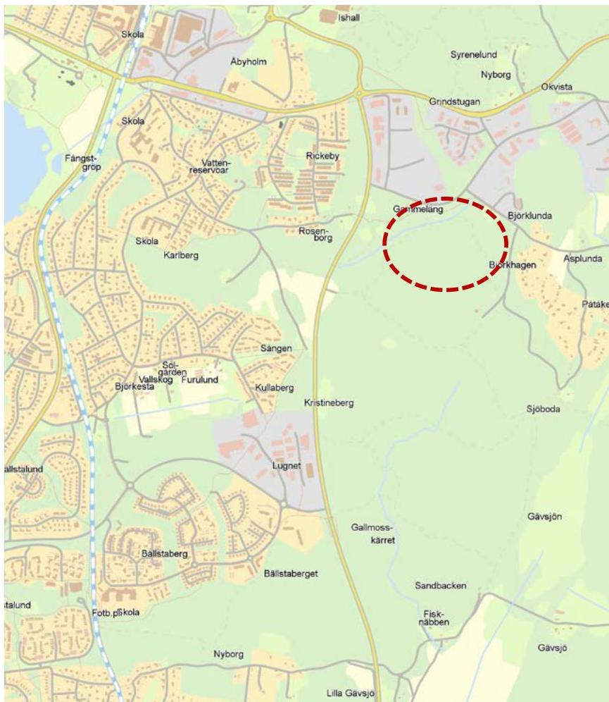(img-1.jpeg)
Översiktskarta, planområdet ungefärligt markerat.

Arbetsmaterial

---

KAPITEL
1

# 2. Planens syfte och huvuddrag

Syftet med detaljplanen är att fullfölja intentionerna i Planprogram för Kristineberg genom att pröva lämplig omfattning och inriktning av bebyggelse med bostäder, lokaler och förskola i norra delen av Kristineberg, etapp 1 av 5.

Detaljplanen omfattar den norra entrén till Kristineberg, vid Okvistavägen, ett samlande torg, ca 250 lägenheter i flerbostadshus, lokaler för centrumändamål/handel, ca 90-95 radhus, ca 40-45 friliggande villor, förskola, park.

För att skapa ett aktivt gaturum placeras husen med bostadsentréer mot huvudgatan, en tydlig entré till området skapas genom att placera flerbostadshus med lokaler i bottenvåningen kring ett samlande torg.

Söder om föreslagen bebyggelse bevaras en grön kil som kopplar samman området med bebyggelsen på västra sidan Arningevägen, syftet är att skapa en tydlig omgivningsanpassad bebyggelsefront mot den gröna kilen i söder.

Detaljplanen ska även säkerställa ett antal kvalitéer och funktioner i planområdets omgivning såsom gång- och cykelvägar, kopplingar till natur- och rekreationsområden och ytor för dagvattenhantering.

(img-2.jpeg)

Planen handläggs med normalt planförfarande enligt PBL 2010:900. Planen befinner sig i samrådsskedet.

# 2.1 Planunderlag

- Miljökonsekvensbeskrivning - planprogram för Kristineberg. Sweco Environment AB, 2014-08-29.
- Kapacitetsutredning Kristineberg - Vallentuna, Sweco, 2014-11-03.
- Riskanalys inför detaljplan Kristinebergsområdet. Sweco Environment, 2014-08-13.
- PM Gestaltningsprinciper för detaljplanering i Kristineberg, Vallentuna kommun 2015-09-21.
- Trafikbullerutredning Arningevägen, Tyréns AB, 2011-04-27.
- Arkeologisk utredning, Okvista 4 arbetsområde Vallentuna socken och kommun, Stockholms läns museum, rapport 2007:17.
- Naturvärdesinventering Kristineberg, Sweco Environment AB, 2014-11-21 (rev bilaga 2015-03-26).
- Dagvattenutredning för planprogram Kristineberg Vallentuna kommun, Sweco Environment, 2015-09-21.
- Kristineberg DP1, dagvattenutredning, Sweco Environment, 2015-09-21.

Arbetsmaterial

---

KAPITEL
1

# 3. Förenlighet med 3, 4 och 5 kap. miljöbalken

## 3.1 Riksintressen

Planområdet berörs inte av några utpekade riksintressen enligt 3 och 4 kap. miljöbalken (MB). Norr om området, ca 1 km, finns ett riksintresse för kulturmiljö, Vada-Össeby-Garn. Angarnområdet cirka 1 km nordöst om planområdet är av riksintresse för naturvården. Arningevägen var tidigare av riksintresse för kommunikation, men detta har förts över på Norrortsleden som nu är utpekad som riksintresse. E18, som Arningevägen ansluter till, är väg av riksintresse.

## 3.2 Miljökvalitetsnormer

### 3.2.1 Luft

Enligt förordningen om miljökvalitetsnormer har regeringen meddelat miljökvalitetsnormer för luft – svaveldioxid, kvävedioxid, kväveoxider, bly, bensen, ozon, kolmonoxid, arsenik, kadmium, nickel, bensen(a)pyren och luftpartiklar (PM10 och PM 2,5).

### 3.2.2 Vatten

Planområdet ingår i Åkerströmmen-Hackstabäckens avrinningsområde. Området avvattnas idag norrut genom befintligt igenväxt åkerdike med utlopp under Okvistavägen som rinner vidare i diken norr om Gävsjön. Vattnet avrinner i förlängningen vidare till Angarnsjöängens naturreservat via diken norrut till vattenförekomsten Åkerströmmen-Hackstabäcken och Angarnssjöängens naturreservat, som även är ett Natura 2000-område, och vidare till Garnsviken och Trälhavet vid Åkersberga.

Vattenförekomsten Åkerströmmen-Hackstabäcken har ekologisk status "mättlig" med krav på god ekologisk status till 2015, med tidsfrist för övergödning och hydromorfologiska förändringar fram till 2021. Den kemiska statusen klassas som "god", exklusive kvicksilver. Miljöproblemen i recipienten omfattar övergödning, syrefattiga förhållanden och miljögifter (Dagvattenutredning för planprogram Kristineberg Vallentuna kommun 2015-09-21). Vallentuna kommun ingår i Oxunda vattensamverkan vilket innebär att Oxundaåns dagvattenpolicy gäller för planområdet. Inom planområdet finns inget skyddsområde för vattentäkt.

Riktvärden för dagvattenutsläpp enligt nivå 1M är använda för att utforma dagvattensystemet. 1 är en nivå som gäller för avrinningsområden som ansluter direkt

Arbetsmaterial

---

KAPITEL
1

till recipient och M avser utlopp i en mindre recipient. Planområdet ansluter inte direkt till någon recipient, men med hänsyn till nedströms recipienters känslighet har den högre nivån valts.

# 4. Plandata

## 4.1 Läge och areal

Planområdet är beläget öster om Arningevägen, strax söder om Okvista industriområde och består av naturmark idag. Området gränsar i öster till Högdalavägen och villabebyggelse i Påtåker, i norr till Okvistavägen och i söder samt väster till naturmark. Planområdet omfattar även huvudgatans koppling söderut till etapp 2. Planområdet omfattar ca 29 hektar. För området finns ett planprogram Kristineberg. Denna detaljplan utgör etapp 1 av totalt 5 delområden i programmet.

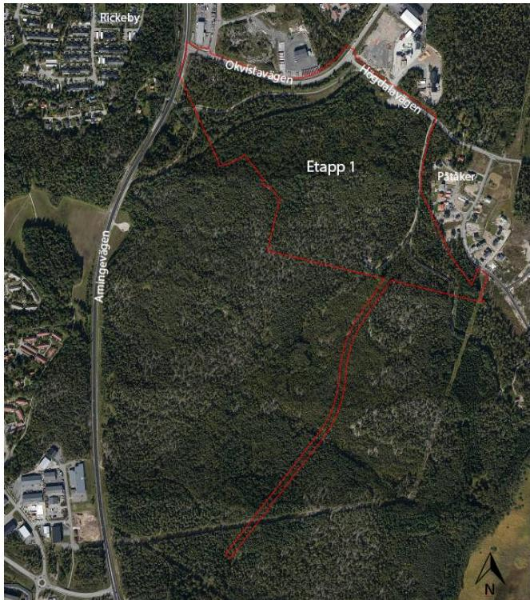(img-3.jpeg)
Planområdets avgränsning, etapp 1 markerad med röd linje.

Arbetsmaterial

---

KAPITEL

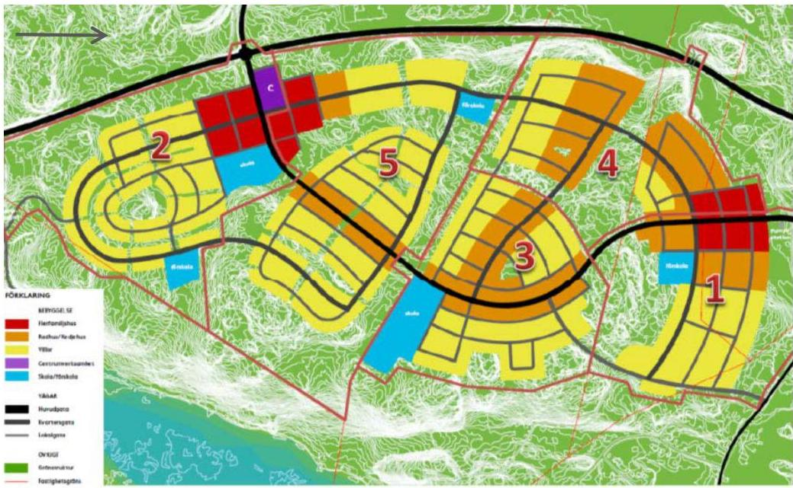(img-4.jpeg)

Etappindelning för Kristineberg, denna detaljplan avser etapp 1 i norra delen. Illustration från Utvecklingsstrategi för Kristineberg – ett tillägg till strukturplan för Södra Vallentuna.

## 4.2 Markägoförhållanden

Marken inom planområdet ägs till största del av Vallentuna kommun. Detaljplanen omfattar kommunens fastigheter: Vallentuna-Rickeby 1:72, 1:436 och 1:135 samt Vallentuna-Mörby 1:297 och Olhamra 1:14. Detaljplanen omfattar även del av den privatägda fastigheten Olhamra 1:53.

## 5. Tidigare ställningstaganden

### 5.1 Översiktliga planer

I Vallentunas översiktsplan 2010-2030, antagen 17 maj 2010 anges planområdet som en del av den centrala stadsbygden med möjlighet för förtätning och utveckling av blandad bebyggelse vilket innefattar, bostäder, arbetsplatser, service, handel, parker och grönområden osv.

- Arningevägen gör det möjligt med en tätare bebyggelse med koppling till Arninge som utvecklas till en yttre regional stadskärna och knutpunkt för kollektivtrafik. Med tät busstrafik blir Arningevägen ett komplement till Roslagsbanan och stärker bandet till södra Vallentuna.
- Den tätare bebyggelsen, som dominerar över natur- och kulturlandskap, måste ges tydliga gränser mot landskapet. Närhet mellan bebyggelse och landskap

Arbetsmaterial

---

KAPITEL
1

uppnås genom en väl genomtänkt grönstruktur från bostadens närmiljö till det stora omgivande landskapet.

- Utvecklingen ska ske i ett möte mellan stadsbygd och landsbygd. Den övervägande delen av nya bostäder, arbetsplatser, handel och service kommer att ligga utefter Roslagsbanan och Arningevägen från kommungränsen mot Täby till och med Molnby/Ubby.
- Fler nybyggda områden med bra kollektivtrafik behövs. Som komplement till Roslagsbanan planeras för en effektiv busstrafik på Arningevägen. Vallentuna förbinder då med Arninge som är en del av den yttre stadskärnan och får pendeltåg eller tunnelbana i framtiden.
- När tätorterna planläggs ska de boendes behov av grönområde beaktas för att ge en god livsmiljö. Närgrönområden ska sammanbindas med strövområden genom attraktiva stråk.
- Det ska vara lätt att förflytta sig. Ny bebyggelse ska till lokalisering och utformning stödja offentliga rum och stråk.

Vallentuna kommuns miljöpolicy, antagen 2013-02-18 utgår från tre fokusområden, ett av dem som berör ny bebyggelse är:

- En attraktiv och hälsosam miljö. Rymmer boendemiljö, tätortsnära miljö, frisk luft, levande sjöar och vattendrag, småskalighet, grönstrukturplan – gröna korridorer.

I den regionala utvecklingsplanen för Stockholmsregionen, RUFS 2010, betecknas området som regional stadsbygd med utvecklingspotential samt som del av en regional grönkil, Rösjökilen.

## 5.2 Detaljplaner, förordnanden

Planområdet gränsar i öster till detaljplan Olhamra D20081104-2 som möjliggör bostäder, i norr till detaljplan för Okvista industriområde D930217-2 och i nordväst till stadsplan för Okvista industriområde S880916. Samtliga detaljplaner påverkas i mindre utsträckning av detaljplaneförslaget Kristineberg etapp 1.

## 5.3 Bostadsbyggnadsprognos 15A

Bostadsbyggnadsprognos 2015-2024 (BBP15A) redovisar pågående och kommande planerings- och utbyggnadsprojekt för nämnda period.

Kristineberg är ett av de större bostadsprojekten i bostadsbyggnadsprognosen. I prognosen anges att ca 400 bostäder i blandad bebyggelse inom Kristineberg kan tillkomma under perioden, vilket avser områdets två entréer i norr och söder etapp 1 och 2.

Arbetsmaterial

---

KAPITEL

1

# 5.4 Tidigare beslut

Kommunstyrelsens näringslivs- och planutskott (NäPlu) gav 2012-11-22 § 147 samhällsbyggnadsförvaltningen i uppdrag att påbörja planering för kommunens mark inom Kristineberg.

NäPlu godkände 2015-02-10 upprättande av förslag till ramavtal § 17 samt att en miljökonsekvensbeskrivning (MKB) § 15 för hela Kristineberg har upprättats.

# 5.5 Program

Planområdet ingår i Strukturplan för södra Vallentuna med program för detaljplanering för Kristineberg som godkändes av Kommunfullmäktige den 18 februari 2013. Planprogrammet var utsänt för samråd under perioden 27 februari – 10 april 2012. Samrådsyttranden och förvaltningens kommentarer finns redovisade i en Programsamrådsredogörelse.

Den 21 augusti 2014 godkändes även Utvecklingsstrategi för Kristineberg – ett tillägg till strukturplan för Södra Vallentuna i Näringslivs- och Planutskottet (NäPlu). Planprogrammet utgör tillsammans med utvecklingsstrategin underlag för fem detaljplaner med en utbyggnad med ca 1700-1800 bostäder, skolor, förskolor och ett stadsdelscentrum i Kristineberg. Inom området planeras för två områden bestående av tätare och högre bebyggelse i flerbostadshus med lokaler för verksamheter, ett i norr och ett i söder. I den södra delen det planerade stadsdelscentrumet att ligga.

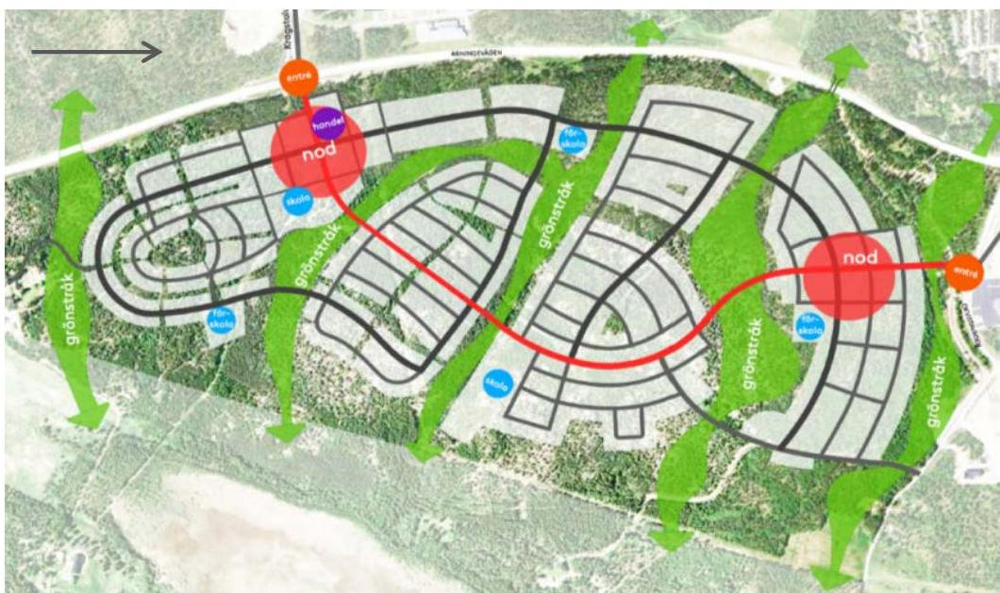(img-5.jpeg)

Arbetsmaterial

---

KAPITEL
1

Värdefulla grönstråk som bevaras i planförslaget i enlighet med gällande översiktsplan och program. Illustration från Utvecklingsstrategi för Kristineberg – ett tillägg till strukturplan för Södra Vallentuna.

# 6. Miljöbedömning/behovsbedömning

Om en plans eller ett programs genomförande kan antas medföra en betydande miljöpåverkan, ska en miljöbedömning göras enligt 6 kap miljöbalken (MB). Behovsbedömning ska göras för alla detaljplaner, för att avgöra om en miljöbedömning ska göras eller inte. Resultatet av behovsbedömningen blir ett ställningstagande till om detaljplanens genomförande kan antas medföra betydande miljöpåverkan eller inte.

Innan kommunen tar ställning till om genomförandet av planen kan antas medföra betydande miljöpåverkan ska kommunen ge länsstyrelsen och andra myndigheter som berörs tillfälle att yttra sig.

Behovsbedömningen för etapp 1 visar att planens genomförande inte innebär någon betydande miljöpåverkan. De miljö-, hälso- och riskfrågor som har betydelse för planen har utretts och beskrivs i denna planbeskrivning (se kap 9 och 11).

# 7. Förutsättningar och förändringar

## 7.1 Natur

### 7.1.3 Grundförhållanden

De geologiska förhållandena varierar i programområdet enligt jordartskartan. Södra delen utgörs till största delen av berg i dagen, i övrigt består området mest av morän och postglacial sand och grus. Infiltrationskapaciteten anses låg till måttlig.

Undersökningar har gjorts i norra delen av området nedanför sluttningen längs med det befintliga diket, Gammeläng. Resultaten visar att marken består av ett lager sand på cirka 1 meter som ligger på 3-5 meter lera som i sin tur underlagras av morän.

Arbetsmaterial

---

KAPITEL

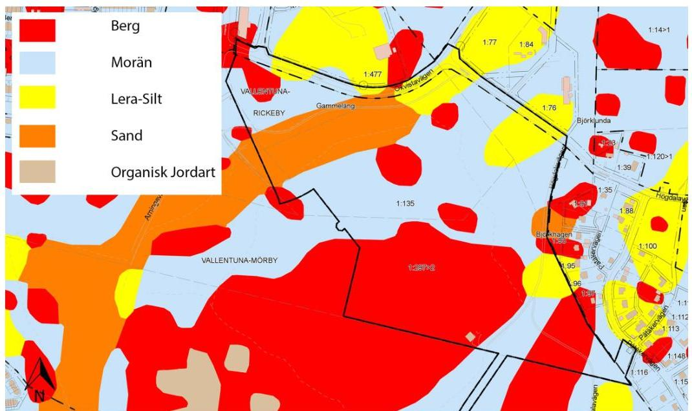(img-6.jpeg)
Översiktlig jordartskarta, planområdet markerat med hel svart linje undantaget huvudgatans förlängning.

## 7.1.4 Topografi, vegetation

Programområdet Kristineberg ligger mellan de regionala grönkilarna Rösjökilen och Angarnkilen. Lokala gröna kopplingar i öst-västlig riktning är viktiga då ny bebyggelse riskerar att försämra tillgången på bostadsnära natur enligt översiktsplanens konsekvensbeskrivning. I utvecklingsstrategin för Kristineberg finns en lokal grönstuktur anvisad och söder om planområdet för etapp 1 finns ett av de gröna stråken. Delar av denna gröna koppling ingår i denna detaljplan.

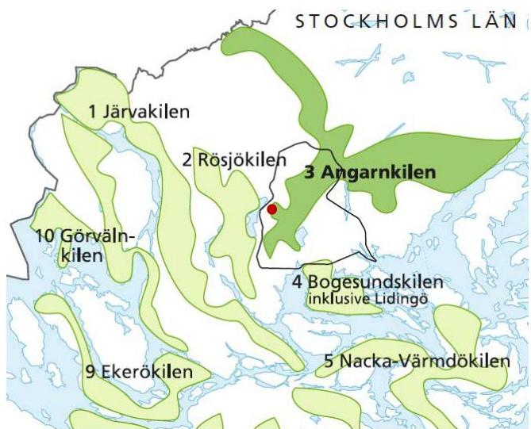(img-7.jpeg)
Gröna kilar i RUFS 2010, Vallentuna kommun markerat med svart linje, Kristineberg markerat med röd prick. Källa: Naturvärdesinventering 2015.

Arbetsmaterial

---

KAPITEL

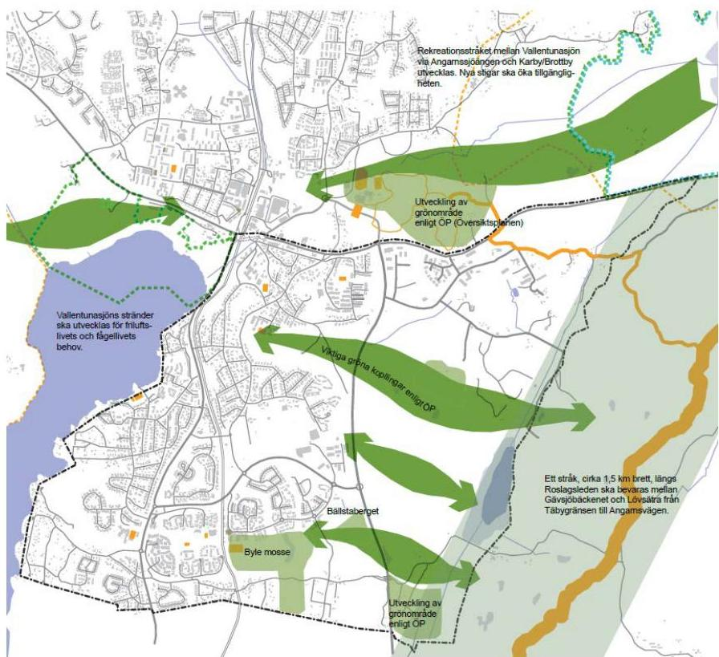(img-8.jpeg)

Grönstruktur i södra Vallentuna i Översiktsplan 2010-2030, Källa: Planprogram för Kristineberg.

Planområdet består av skogs- och hällmark i kuperad terräng, en karaktär som återkommer i programområdet och som även fungerar som värdefull rekreationsskog. Hela Kristineberg är genomkorsat av välanvända stigar (Naturvärdesinventering, 2015). Genom området går ett spricklandskap, Gävsjödalen som ramas in av branta sluttningar och området saknar karaktären av öppet landskap. Gammeläng, i norra delen av området, har tidigare varit uppodlad och består idag av igenväxande ytor med stort lövinslag. Området är ett värdefullt ängs- och våtmarksstråk för bl.a. groddjur och fjärilar (Avgränsning av värdefull vegetation i Kristinebergsskogen, WSP, 2011-03-16).

Området avvattnas idag norrut genom befintligt igenväxt åkerdike med utlopp under Okvistavägen som rinner vidare i diken norr om Gävsjön. Vattnet avrinner i förlängningen vidare till Angarnsjöängens naturreservat som även är ett Natura 2000-område.

En naturvärdesinventering (NVI) är framtagen för hela Kristineberg (NVI, Sweco, 2014) i syfte att kartlägga områdets betydelse för biologisk mångfald. Inom hela området Kristineberg finns sju naturvärdesobjekt med påtagliga eller höga naturvärden. Klassificeringen av naturvärden i rapporten utgår från Svensk standard, där tre klasser definieras;

Arbetsmaterial

---

KAPITEL
1

- Naturvärdesklass 1 – högsta naturvärde
- Naturvärdesklass 2 – högt naturvärde
- Naturvärdesklass 3 – påtagligt naturvärde

Inom etapp 1 finns två naturvärdesobjekt. Dels naturvärdesobjekt 1 (NVO 2015) av naturvärdesklass 3, dels norra delen av naturvärdesobjekt 2 (NVO 2015) av naturvärdesklass 2. Naturvärdesinventeringen har legat till grund för utformningen av strukturen i området.

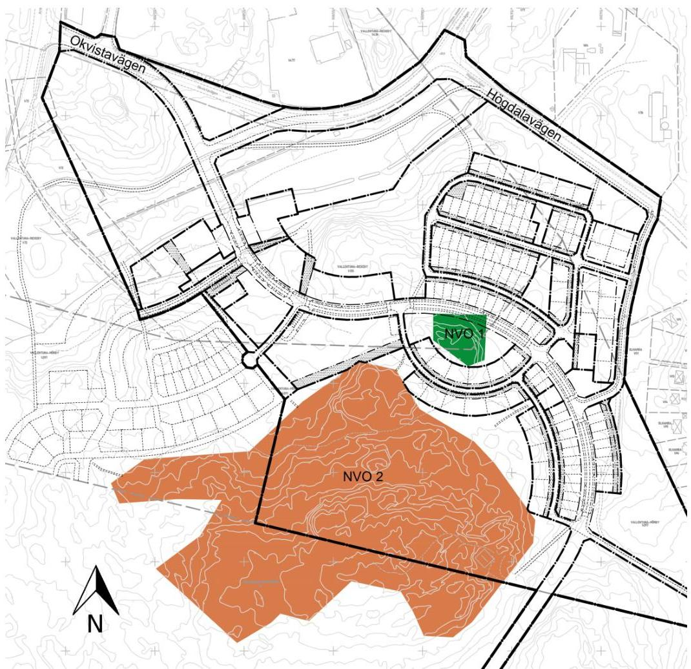(img-9.jpeg)
Planförslagets kvarter och gatustruktur jämfört med Naturvärdesobjekt (NVO) 1 och 2.

Naturvärdesobjekt 1 utgörs av ett litet hällområde i skogens norra del med ett 15-tal gamla tallar med pansarbark varav en är mycket grov (ca 65 cm diameter i brösthöjd) med tanke på den magra växtplatsen. Uppskattad ålder 200-300 år. I fältskiktet växer ljung, blåbär och lingon. I bottenskiktet finns t ex vitmossa, renlavar och fönsterlavar. Några tallågor förstärker intrycket av ålderstigen skog och höjer därmed värdet.

Arbetsmaterial

---

KAPITEL
1

Naturvårdsarter: motaggsvamp. Objektets naturvärde består främst av naturvärdesträd i form av gamla tallar och ett visst artvärde. Den begränsade arealen sänker värdet och naturvärdet bedöms som påtagligt.

Naturvärdesobjekt 2 utgörs av hällmarkstallskog med en stor andel riktigt gamla tallar, en del troligen 200-300 år. Många av tallarna är klena och senvuxna men i beståndet finns också spridda ganska grova tallar, upp till ca 60 cm, trots magra förhållanden. Yngre tall och björk finns spridda i det ofta glesa trädskiktet. Mellan hällarna i sänkor finns ofta små skvattramtallmyrar med senvuxna klena tallar. Här och där finns också gamla senvuxna granar. I fältskiktet växer ljung, blåbär och lingon. I bottenskiktet finns t ex vitmossa, islandslav, renlavar och fönsterlavar. I en stor del av objektet är det gott om död ved, både i form av lågor och stående döda träd. En del träd har hål och hack av hackspettar. På några ställen finns spår av manuell avverkning i form av stubbar och kapade grenar, även av åtgärder gjorda i ganska sen tid. Ett möjligt brandljud påträffades också på tall. Naturvårdsarter: tofsmes, spillkråka, tallticka och motaggsvamp. Objektets naturvärde består främst av en naturlig skogsstruktur (öppen, gles, flerskiktad hällmarksskog), naturvärdesträd i form av gamla tallar och en relativt riklig tillgång på död ved samt ett påtagligt artvärde. Naturvärdet bedöms som högt.

## 7.2 Fornlämningar

En särskild arkeologisk utredning genomfördes för kommunens mark inom Kristineberg, av Stockholms läns museum, i maj 2007 då planområdet utreddes för planläggning för handel och industri. Arbetet omfattade en byråinventering, en fältinventering, sökschaktning och grävning av provgropar. Inga fornlämningar påträffades inom utredningsområdet.

Området ingår i ett av Vallentuna kommun utpekat område med höga kulturhistoriska värden. Området, Tuna, utgör en intressant administrativ ägostruktur som kan utgöra en viktig pusselbit för forskning kring sockenbildning och ägandeformer under äldre tid och hur dessa har förändrats in i modern tid. (Kulturmiljöprogram för Vallentuna kommun, 2010).

## 7.3 Bebyggelseområden

### 7.3.1 Befintliga bostäder

Vallentuna växer och det finns ett stort behov av bostäder. Nya bostäder ska tillkomma vid goda kollektivtrafiklägen och där nya bostäder kan tillföra kvaliteter till helheten. Inom planområdet finns idag ingen bebyggelse. På andra sidan Arningevägen präglas bebyggelsen av radhus och friliggande småhus samlade runt ett grönt stråk. I

Arbetsmaterial

---

KAPITEL
1

anslutning till planområdet i öster finns ett nybyggt område, Påtåker, bestående av friliggande villor.

## 7.3.2 Ny bebyggelse

### Områdets struktur

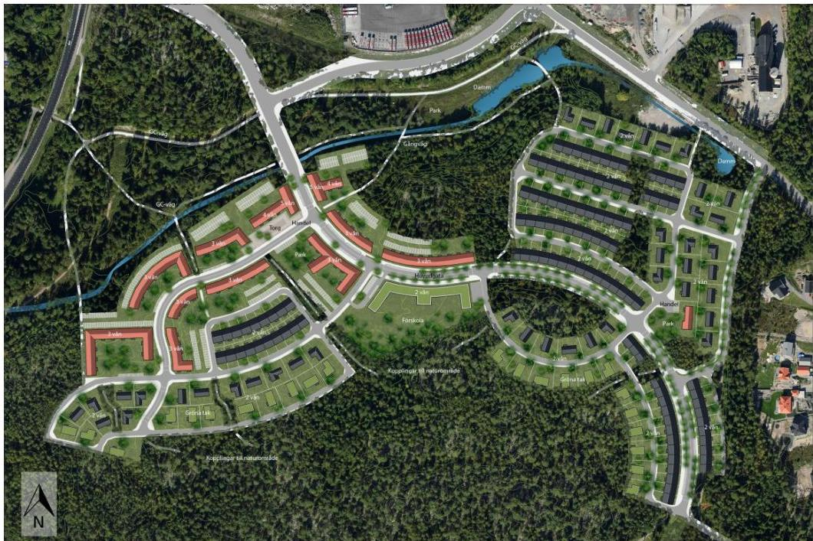(img-10.jpeg)

Illustrationsplan för kommunens mark inom etapp 1 och del av framtida etapp 4, Sweco Architects 2015.

Områdets övergripande gestaltning och struktur tar fasta i de naturvärden som platsen erbjuder och som beskrivits i kommunens översiktsplan och miljöpolicy samt naturvärdesinventeringen.

Entrén till området utgörs av den nod som beskrivs i utvecklingsstrategin för Kristineberg. Flera skäl gör denna plats lämplig för en högre exploatering med flerbostadshus och även servicefunktioner:

- området utgör angöringspunkt mot Arningevägen där en stor andel av Kristinebergs invånare kommer att passera dagligen
- området utgör ingen mark med utpekande naturvärden
- området ligger närmast Vallentunas centrala delar och utgör en naturlig utveckling i befintlig bebyggelseväv.

Arbetsmaterial

---

KAPITEL
1

Området präglas av en central torg- och parkmiljö runt vilka bebyggelsen grupperas. De allmänna platserna inbjuder till samvaro där torget har ett solläge invid bottenvåningar avsedda för verksamheter.

Gröna korridorer bryter igenom strukturen och knyter samman gröna rum och parkmiljöer med den centrala naturvärdeskärnan i södra delen av planområdet.

Ett nätverk av gång- och cykelvägar passerar genom de gröna korridorerna och naturmiljön vilka inbjuder till rörelser och ett aktivt användande av naturmarken.

Den mer bullerutsatta och sanka marken norr om entrénoden används som bullerbufferton mot Arningevägen och till rekreation där dagvattenhanteringen utgör ett positivt värde i en parkmiljö.

Söder om entrénoden följer huvudgatan terrängen och anpassar sig till naturen. Bebyggelsen förläggs med huvudfasader med entréer mot huvudgatan för att skapa ett tydligt gaturum. Utanför den tätare entrénoden är dock detta gaturum småskaligare och mer utblandat med naturmiljön, med sparade barrträd där detta är möjligt.

Närmast den utpekade naturvärdeskärnan hålls exploateringen lägre med villabebyggelse med större tomter och en begränsning av byggnadsarean.

I nordöstra hörnet av planområdet föreslås en tätare villa- och radhusbebyggelse. Här finns även underlag för service, som en enstaka restaurang insprängd i bebyggelsen.

I väster är den fortsatta planeringen i etapp 4 tänkt att vara en fortsättning av strukturen och omfamna naturområdet.

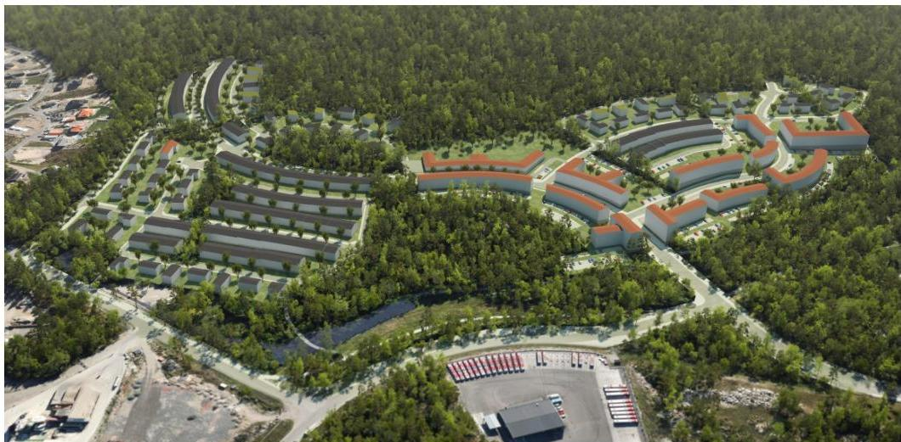(img-11.jpeg)

Volymskiss över kommunens mark, etapp 1 och del av etapp 4, sedd mot söder. Påtåker i vänster och Okvista längst ner i bilden. Sweco Architects 2015.

Arbetsmaterial
14

---

KAPITEL
1

# Flerbostadshus

I anslutning till den norra entrén av planområdet möjliggörs uppförandet av flerbostadshus med möjligheter till lokaler för verksamheter i bottenplan. Inom etapp 1 planeras för ca 250 lägenheter. Verksamhetslokaler med entréer ligger i gatans nivå och husens entréer placeras ut mot gatan. Bostadsentréerna ska vara tydligt markerade mot gatan och med genomgående entréer till gårdarna.

Kvarteren är väl definierade mot omgivande gator med en tydlighet mellan det privata och det offentliga där huvudfasaden placeras längs gatan. Vid entréerna finns plats för cykelparkering.

Flerbostadshusen har en varierande höjdskala från tre våningar till fem våningar utmed huvudgatan vid områdets norra entré.

Komplementbyggnader utformas i trä med sedumtak för att stärka det gröna i området och för viss lokal avledning av dagvatten.

För att skapa variation markeras husen trapphusvis med färgnyanser som harmonierar med varandra. Materialvalen är friare och kan ges en större tyngd med putsfasader och stensocklar, men kan även utgöras av ett lättare uttryck med träfasader. Gestaltningsprinciper för byggnaderna kommer att utvecklas vidare i fortsatt planarbete.

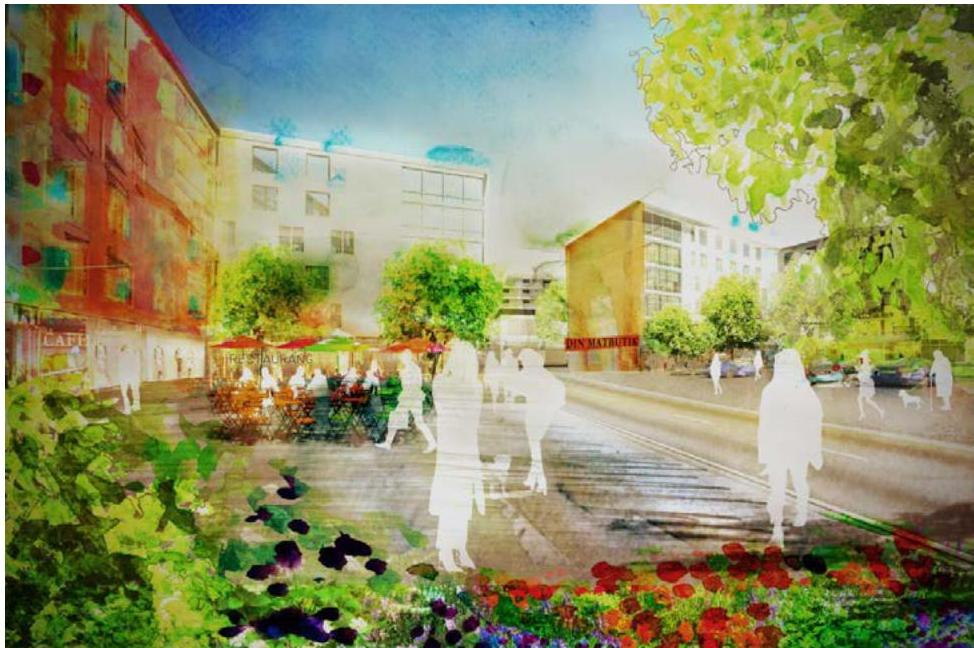(img-12.jpeg)
Perspektiv över torget vid den norra entrén med flerbostadshus med verksamheter i bottenvåningen, Sweco Architects, 2015.

För att skapa förutsättningar för stadsliv innehåller flerbostadshusen närmast torget och den centrala parken verksamhetslokaler i delar av bottenvåningen. Andelen

Arbetsmaterial

---

KAPITEL
1

verksamhetslokaler regleras i plankartan till att uppgå till 100 procent av fasadytan mot torget. I övrigt får lokaler för icke störande verksamhet anordnas i samtliga kvarter.

# Radhus och friliggande småhus

Utmed huvudgatan och i planområdets östra del föreslås ca 90-95 radhus och ca 40-45 friliggande småhus. Bebyggelsen får uppföras i två våningar med en byggnadsarea på 120 m²-140 m². Tomternas storlek varierar från ca 250 m²-600 m².

Bebyggelsen längs huvudgatan skall placeras med fasader och entréer mot gatan för att ge en sammanhållen rumslighet i gatubilden. Vad gäller denna bebyggelse och bebyggelsen i planens nordöstra del är gestaltningen friare. Fasadmaterialen kan förslagsvis utgöras av tegel eller träpanel och byggnadsarean är högre, 140 m² vilket ger en större täthet.

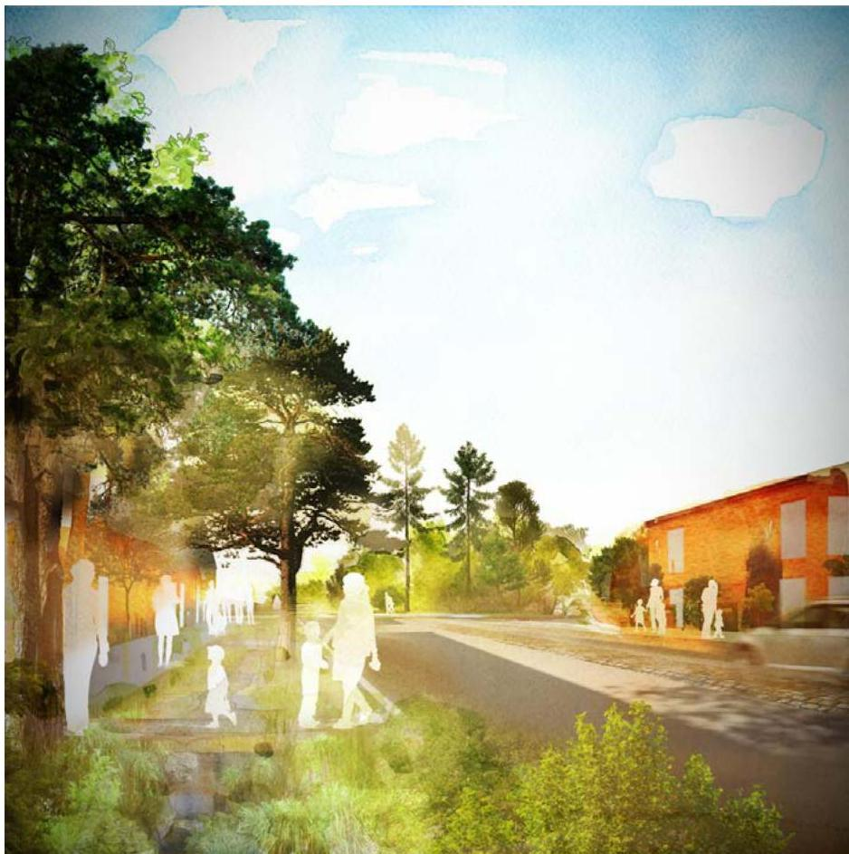(img-13.jpeg)
Perspektiv vid radhus utmed huvudgatan. Illustration Sweco Architects, 2015.

Bebyggelse som gränsar mot den utpekade naturvärdeskärnan har högre utformningskrav för att anpassa sig till naturmiljön. Minsta tomtstorlek är här 500 m² och största byggnadsarea 120 m² för att ge en luftigare och grönare miljö.

Arbetsmaterial
16

---

KAPITEL
1

Fasadmaterialiet begränsas till tegel för att ge ett sammanhållen visuellt uttryck mot skogsmarken. Takvinkel hålls nere till 15 grader för att minimera att taken dominerar miljön samtidigt som takmaterialen skall utformas svarta eller som gröna tak med en taktäckning av exempelvis sedum.

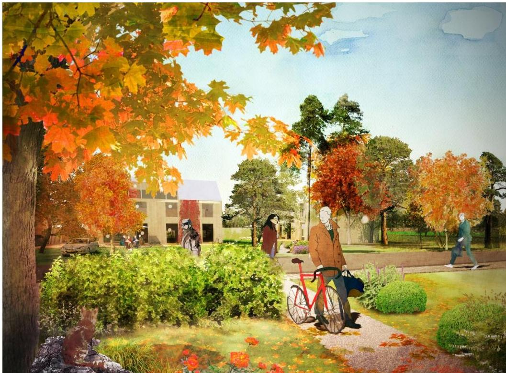(img-14.jpeg)
Perspektiv från villagata. Illustration Sweco Architects, 2015.

## Förskola

I anslutning till torget och längs med den nya huvudgatan placeras en förskola. Fastigheten angränsar i söder till ett större område med naturmark, utpekat som naturvärdesområde, området ingår i en av de gröna kilarna som går genom området i öst-västlig riktning. Området omfattar ca 8 300 m². Förskolan planeras för totalt ca 100 barn.

Marken är relativt flack i norr mot huvudgatan och höjs i söder mot hällmarksområdet vilket är en tillgång till förskolan och bidrar till en varierande lekmiljö. Från skolan skapas ett nät av gång- och cykelvägar som gör det lätt att ta sig till och från förskolan på ett trafiksäkert sätt, men vilka även kopplar skoltomten till naturområdet.

Detaljplanens bestämmelser ger en flexibilitet i byggrätter för att kunna anpassas till kommande behov över tid. I dagsläget bedöms ca 2 000 m² byggnadsarea behövas och planen möjliggör en byggrätt upp till två våningar. Byggnaden utformas i tegel med grönt beväxt alternativt svart tak med syfte att skapa en mjuk övergång mellan bebyggelse och naturmark.

Arbetsmaterial

---

KAPITEL
1

## 7.3.3 Arbetsplatser

Norr om planområdet finns Okvista industriområde som består av småindustri, en bussdepå, bygghandel, bilprovning och Eon fjärrvärmeverk m.m. se vidare avsnittet 9.2 om risker och störningar från verksamheter.

Planförslaget ger möjlighet till flerbostadshus med verksamhetslokaler i bottenvåningen och kommer därmed att medföra ett mindre tillskott av arbetsplatser.

## 7.3.4 Befintlig kommersiell och offentlig service

Större livsmedelsbutiker, vårdcentral, gymnasium m.m. finns i centrala Vallentuna ca 2 km nordsväst om planområdet. I Rickeby, väster om Arningevägen finns tre stycken förskolor och i Karlberg, ca 1 km väster om planområdet, finns närmaste grundskola.

Planförslaget ger möjlighet till en ny förskola längs med huvudgatan. Inom etapp 2 i södra Kristineberg planeras för en F-6 skola.

## 7.3.5 Handel och centrum

Inom planen möjliggörs för flerbostadshus med lokaler för verksamheter i bottenplan. Husen placeras i anslutning till huvudgatan samt kring torget i norra delen av planområdet. I de två kvarter som omger torgytan ska 100 procent av fasadytan mot torget innehålla lokaler för handel, beteckning C. I övrigt får lokaler för icke störande verksamhet anordnas i samtliga kvarter, beteckning H. Läs mer under avsnitt flerbostadshus kap. 7.3.2.

Längre söderut inom etapp 2 för Kristineberg, planeras för centrumverksamhet, handel och en F-6 skola. Planprocessen för etapp 2 bedrivs parallellt med etapp 1.

## 7.4 Gator och trafik

### 7.4.1 Trafik och parkering

#### Arningevägen

Planområdet ligger parallellt med Arningevägen, väg 264. Arningevägen är sekundär transportled för farligt gods.

Det finns utvecklingsplaner för väg 264/Arningevägen för att förbättra framkomligheten och bygga ut cykelvägnätet i samband med att Vallentuna växer. Arningevägens förlängning utreds inom pågående arbete med fördjupad översiktsplan för Norra Vallentuna och Lindholmen. Enligt uppgift kommer ingen breddning att ske

Arbetsmaterial
18

---

KAPITEL
1

före 2025 och det är osäkert om och i så fall när det kan komma att ske. Detaljplanens genomförande hindrar dock inte dessa framtida planer då det finns utrymme på både östra och västra sidan vägen. En eventuell zon för genomfart ska studeras vidare i det fortsatta planarbetet.

Arningevägen är i dag relativt högt trafikerad med ca 13 500 fordon per medeldygnstrafik (Trafikverket, mätning 2013-01-01) varav den största delen utgörs av genomfartstrafik. Andelen tung trafik på Arningevägen är cirka 9 procent och hastigheten är begränsad till $80\mathrm{km/h}$. Uppskattad ökning av trafik på Arningevägen uppskattas öka till ca 30 100 fordon år 2030 (WSP, 2013).

# Kapacitet

En Kapacitetsutredning Kristineberg – Vallentuna (Sweco) 2014-11-03 har genomförts som visar en prognos om hur den framtida exploateringen kommer att påverka det omkringliggande vägnätet, dess kapacitet och belastning för området fram till år 2030. Utredningen föreslår en korsning med väjningsplikt i den norra infarten (2) och en cirkulationsplats i den södra infarten (1).

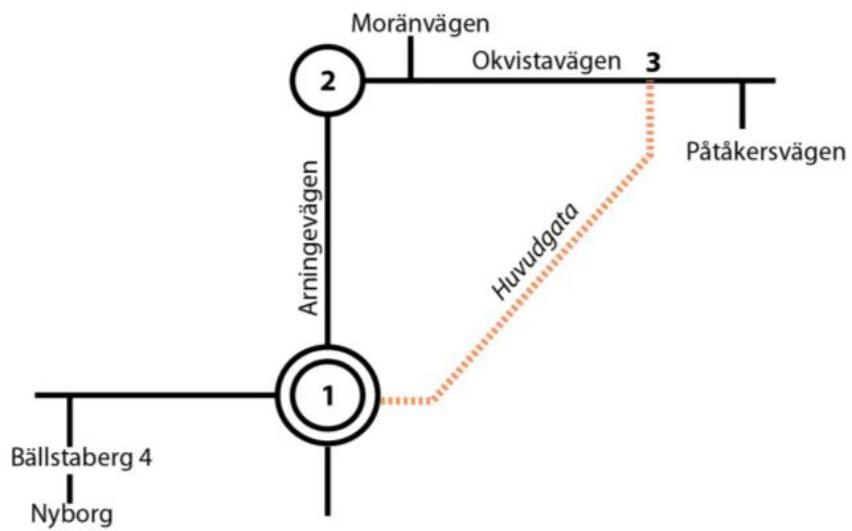(img-15.jpeg)

Översikt - förslagna korsningar till och från planområdet, Kapacitetsutredning 2014.

Utredningen uppskattar att ca 20 procent av trafiken till Kristineberg kommer att ske via den norra infarten och resten i den södra. Trafik från verksamhetsområdet på Moränvägen och Påtåkersvägen kommer att ske via korsning nr 2 och de nya områdena Nyborg och Bålstaberg 4 kommer att använda korsning 1.

Vid en känslighetsanalys där man ökar samtliga trafikflöden med tio procent, får samtliga korsningar godkända värden.

Arbetsmaterial
19

---

KAPITEL
1

Trafikverket har behov av en byggnadsfri zon i vägens närhet. Det byggnadsfria avståndet säkerställs i detaljplanen genom användningsbestämmelsen NATUR1 - naturmark.

## Gatustruktur

Planerad bebyggelse inom Kristineberg, men även planerad bebyggelse väster om Arningevägen medför en ökad trafik på Arningevägen. Genom Kristineberg kommer en ny huvudgata anläggas som kopplar samman Okvistavägen med Bällstabergsvägen. I aktuellt planförslag ingår huvudgatans dragning från korsningen vid Arningevägen/Okvistavägen och ner till etapp 2. Okvistavägens nuvarande sträckning dras delvis om då huvudgatans riktning föreslås mot den nya bebyggelsen mot söder. Vägen från verksamhetsområdet (nuvarande Okvistavägen) kopplas på den nya huvudgatan med en T-korning.

Huvudgatans dragning söder om föreslagen bebyggelse i etapp 1 behöver studeras vidare i det fortsatta planarbetet för att få den bästa dragningen i förhållande till fortsatta byggnadsetapper.

Huvudgatan blir ett centralt stråk med möjlighet till framtida busstrafik. Huvudgatan kommer att utformas med gång- och cykelväg, grönska och delvis kantstensparkering med en väggbredd på ca 17 meter. Övriga gator i planområdet ges en bredd på ca 6,5 till 10,5 meter. Längs gaturummen ska områdets karakteristiska barrträd sparas så långt detta är möjligt.

En möjlighet finns också att koppla den nya bebyggelsen till den befintliga i Påtåkerområdet. En vägsträckning skulle då följa befintlig vägsträckning i östra delen av planområdet och ansluta till Påtåkerområdet vid transformatorstationen i naturmarken vid Påtåkersvägen. Här finns en möjlighet att dra vägsträckningen antigen norr eller söder om transformatorstationen. Denna fråga måste vidare utredas under planarbetet.

Arbetsmaterial
20

---

KAPITEL
1

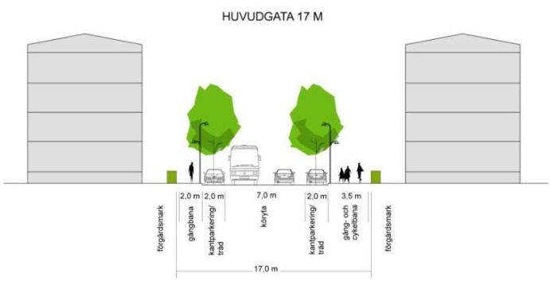(img-16.jpeg)

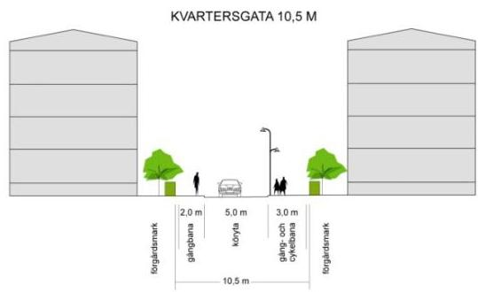(img-17.jpeg)

Gatusektioner för området, efter underlag i Utvecklingsstrategi för Kristineberg. JM/ÄWL Arkitekter.

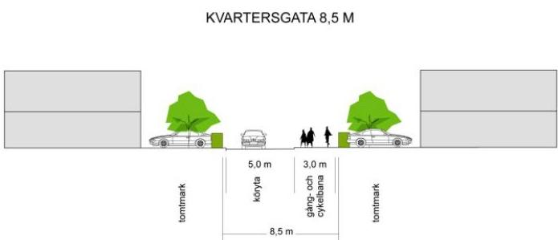(img-18.jpeg)

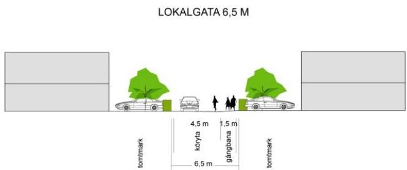(img-19.jpeg)

Arbetsmaterial
21

---

KAPITEL
1

Gatusektioner för området, efter underlag i Utvecklingsstrategi för Kristineberg. JM/ÄWL Arkitekter.

## Bilparkering

Parkering ska dimensioneras i enlighet Vallentuna kommuns parkeringsnorm, antagen 16 januari 2012. Parkeringsnormen är baserad på en zonindelning där närhet och turtäthet till kollektivtrafik och service är avgörande för att minska behovet av att använda bil. Planområdet ingår i zon 1.

Parkering för flerbostadshus (inom zon 1) ska beräknas enligt:

[tbl-0.html](tbl-0.html)

Parkering inom flerbostadshuskvarteren föreslås lösas i garage och markparkering. Besöksparkering sker i huvudsak som kantstensparkering längs huvudgatan. Flerbostadshusen är utformade med ett p-tal enligt parkeringsnormen, zon 1. Detta bedöms ge ett p-behov på ca 30-40 p-platser per bostadskvarter, beroende på antal lägenheter och lägenhetsstorlekar.

Vid handelsnoderna ska elladdstolpar finnas för laddning av elfordon.

För småhus gäller följande:

[tbl-1.html](tbl-1.html)

Parkeringsnorm zon 1 enligt Vallentuna kommuns parkeringspolicy.

## Cykelparkering

Cykelparkering anordnas om minst två st. cykelparkeringsplatser vid flerbostadshus varav hälften ska anordnas skyddat under tak. Platser för cyklar ska finnas i anslutning till entréerna. Parkering för cykel på småhusmarken och radhusbebyggelsen löses inom fastigheten.

## 7.4.2 Gång- och cykelvägar

Norr om planområdet, parallellt med Okvistavägen finns en befintlig gång- och cykelväg som passerar i tunnel under Arningevägen. Den befintliga gång- och cykelvägen kopplas samman med det nya gång- och cykelvägnätet inom etapp 1.

Arbetsmaterial

---

KAPITEL
1

Parallelt med Arningevägen finns även en befintlig gång- och cykelstig.

Gång- och cykelförbindelser säkerställs i planförslaget så att säkra förbindelser, främst för barn, kan åstadkommas men även för att öka tillgängligheten till målpunkter som service, skola, Roslagsbanan och övrig kollektivtrafik i närområdet.

Enligt Vallentunas cykelplan, samrådshandling februari 2014, ska dimensioneringen av huvudvägnätet möjliggöra att två cyklister kan mötas samtidigt som två gående passerar. Cykelbanorna ska vara utformade med tillräckliga breddmått, asfalterade och belysta. Arningevägen är utpekad som ett framtida regionalt cykelstråk.

Inom området finns idag väl använta gångstråk. Dessa kommer i vissa delar läggas om i nya sträckningar. Strukturen innebär flera kopplingar till befintliga stråk från den nya bebyggelsen som möjliggör god tillgänglighet till omgivande naturområden.

## 7.4.3 Kollektivtrafik

Den nya huvudgatan genom Kristineberg är möjlig att trafikera med busslinje om ny linjedragning blir aktuell. Busshållplats föreslås vid torget längs med huvudgatan, vid förskolan och vid korsningen av lokal gatan mot Högdalsvägen. Busshållplatserna föreslås utformas som klackhållplatser.

Närmaste stationer vid Roslagsbanan är Bällsta och Vallentuna, ca 2 km via gång- och cykelväg från planområdet.

Längre söderut vid korsningsläget Bällstabergsvägen och Arningevägen finns busshållplats "Skogsbrynet" där buss 608 stannar som går till centrala Stockholm.

Roslagsbanan är kommunens spårbundna huvudstråk för kollektivtrafiken, tillsammans med två större huvudgator Stockholmsvägen och Arningevägen. Mellan station Kragstalund och Täby kyrkby planeras utbyggnad av dubbelspår och mellan Kragstalund och Vallentuna pågår utbyggnad av dubbelspår. Längs med Stockholmsvägen finns regionala busslinjer, främst när det är rusningstrafik, för att bland annat avlasta Roslagsbanan.

## 7.4.4 Tillgänglighet

Mål avseende tillgänglighet i form av lutningar till entréer, angöring, utemiljöer etc. bedöms kunna uppnås men ska behandlas vidare i samband med byggnads- och markprojekteringen.

Vid flerbostadshusen ska kärl för hushållsavfall och matavfall placeras maximalt 50 meter från entré. Miljöhus för förpackningsinsamling alt. miljörum ska placeras inom 100 meter från samtliga entréer vid flerbostadshusen.

Arbetsmaterial

---

KAPITEL
1

Alla bostäder ska kunna angöras inom 25 m från entré. Tillgänglig småbarnslek finns på gårdarna i flerbostadshusen. Områden med naturlek nås via lokalgatorna.

## 7.5 Friytor

### 7.5.1 Lek och rekreation

Inom Kristineberg finns det flera fina naturmiljöer för rekreation. Närliggande grönytor innebär att förutsättningarna för friytor för lek och rekreation är gynnsamma. Barnen kan röra sig trafiksäkert på gång- och cykelbanor samt längs de många stigar och smitvägar som finns i grönstrukturen. I södra delen av området bevaras ett större naturmarksområde vilken kompletteras med mindre ytor med natur med naturlek mellan småhusen. Inom flerbostadshusens gårdar finns anlagd lek.

Inom planen regleras lek som naturlek – naturlekplats där områdets skogskaraktär utnyttjas.

I anslutning till det södra naturområdet planeras en förskola. Skolgårdarnas ytor och lekmöjligheter nyttjas av skolbarnen under dagtid, men utgör också ett tillskott av utemiljö för de boende på kvällar och helger.

Norr området iordningsställs befintligt dike i samband med en ny dagvattendamm. Området planläggs som parkmark med gång- och cykelvägar. Ytan kan användas för vistelse och lekmiljö vid torrare perioder.

### 7.5.2 Naturmiljö

Planens genomförande innebär att delar av planområdet övergår från oexploaterad skogsmark till en bebyggd miljö. Bebyggelsestrukturen är planerad längs med gröna stråk och stigar vilka anpassar sig till omkringliggande skogs- och naturmarker.

Området innehåller naturmark vilken idag inte är utpekad som bevarandevärd. Delar av denna mark bibehålls i planen för att erbjuda gröna stråk och rekreationsmiljöer till de boende. Områdena betecknas i planen NATUR1 – Natur/skogsmark.

I den södra delen av planområdet ligger idag en utpekad naturvärdeskärna med höga naturvärden i form av bland annat friliggande hällar. Områdena betecknas i planen med bestämmelsen NATUR2 – Naturvärdeskärna.

Arbetsmaterial

---

KAPITEL
1

# 7.6 Markavvattningsföretag

Inom planområdets norra del finns ett aktivt markavvattningsföretag för dike Gammelängs tf. daterat 1929. Området har tidigare varit uppodlat men består idag av igenväxande ytor med stort lövinslag. Markavvattningsföretaget gränsar mot planerad bebyggelse inom etapp 1. Syftet är att iordningsställa diket och nyttja för fördröjning av dagvatten och att i anslutning anlägga en dagvattendamm, läs mer under 7.7.2 dagvatten.

# 7.7 Teknisk försörjning

## 7.7.1 Vatten och spillvatten

Planområdet gränsar till kommunens verksamhetområde för VA, där Roslagsvatten är huvudman för allmänt vatten och spillvatten. I och med planläggningen kommer området ingå i VA-utbyggnaden mellan Karby och Brottby i Okvista och vidare till Täby. Ledningarna och tillgängligheten till dessa säkerställs genom förläggning i allmän platsmark. Efter planens genomförande ska området ingå i verksamhetsområdet.

Vallentunavatten AB är huvudman för allmänna vatten och spillvatten inom verksamhetsområde för allmänt VA i Vallentuna kommun. Bebyggelse ska anslutas till befintligt ledningsnät för vatten och spillvatten.

Placering och behov av tekniska anläggningar ska studeras vidare i det fortsatta planarbetet.

## 7.7.2 Dagvatten

Dagvatten från tillkommande bebyggelse ska omhändertas enligt Oxundaåns dagvattenpolicy. En dagvattenutredning för hela programområdet Kristineberg och en detaljerad för etapp 1 finns framtagen (Sweco, 2015).

Området avvattnas idag norrut genom befintligt igenväxt åkerdike med utlopp under Okvistavägen som rinner vidare i diken norr om Gävsjön. Vattnet avrinner i förlängningen vidare till Angarnsjöängens naturreservat som även är ett Natura 2000-område. Kristineberg tillhör Hackstabäckens avrinningsområde som avvattnas till Angarnssjöängen, vilken är en fågelsjö och naturreservat. Vattenförekomsten Åkerströmen – Hackstabäcken har enligt VISS måttlig ekologisk status och uppnår inte god kemisk status.

Höjdsättningen av området är utformad med tanken att dagvattnet ska avrinna med självfall till så få punkter som möjligt där det kan tas omhand. De naturliga

Arbetsmaterial
25

---

KAPITEL

förutsättningarna i området med en höjdrygg som delar av området ger två punkter dit vattnet är lämpligt att ledas för att slutligen samlas upp i en punkt och sedan ledas ut på det befintliga dagvattennätet (Dagvattenutredning etapp 1, Sweco, 2015).

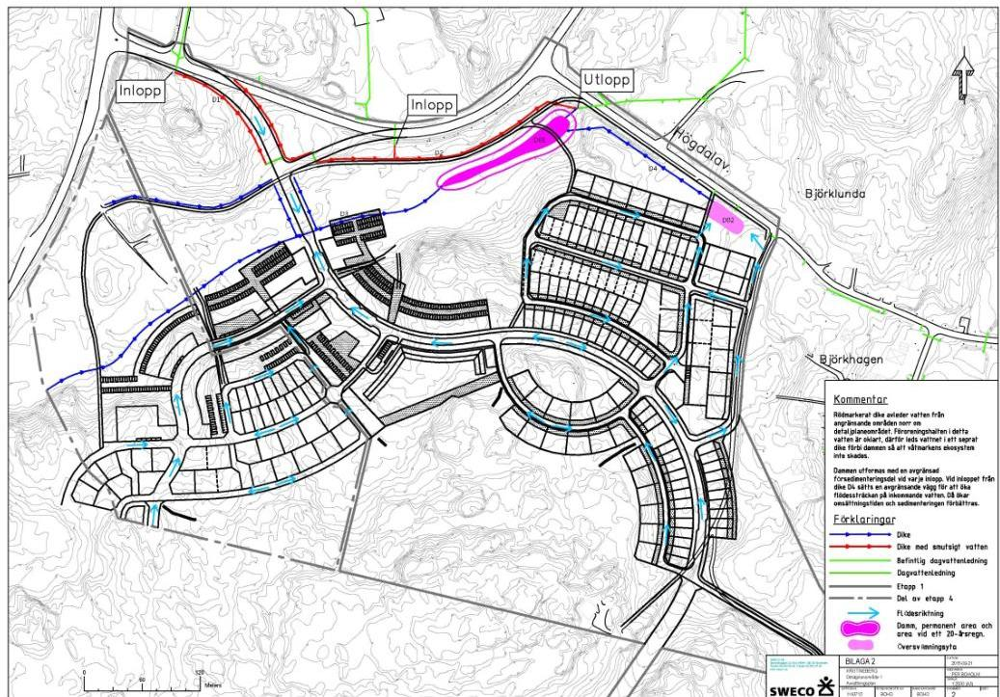(img-20.jpeg)

Avvattningsplan för dagvatten, Kristineberg DP1 Dagvattenutredning Bilaga 2, Sweco.

Den västra delen av området föreslås ledas till det befintliga diket (D3) som idag följer lågstråket genom området österut. Diket görs iordning så att det får en tillräcklig kapacitet och lutning. Diket mynnar sedan i en damm (D01) i den nordöstra delen av området. Dammen är tänkt att båda kunna fördröja större flödestoppar och rena inkommande dagvatten. Dammen dimensioneras så att kapaciteten i det befintliga dagvattenledningsnätet nedströms ska vara tillräcklig även efter en exploatering.

Den östra delen av området föreslås ledas till en översvämningsyta (D02) i nordöstra delen av området. Istället för att vattnet leds österut längs med Högdalavägen som tidigare så leds det västerut till den föreslagna dammen där det fördröjs. I första hand föreslås det att ett dike (D4) anläggs som sammanbinder översvämningsytan med dammen. Är det inte möjligt att ha dike hela sträckan kan trumma läggas på delar av sträckan. För att undvika för stor dimension på trumman så utnyttjas översvämningsytan för att fördröja toppflödena. Om det blir dike hela sträckan kan översvämningsytan utgå.

Samtliga vägar i området höjdsatts så att lågpunkter undviks och vattnet kan avledas med självfall till avsedda punkter för omhändertagande.

Arbetsmaterial

---

KAPITEL
1

Dagvattnet från angränsande områden norr om detaljplaneområdet föreslås att ledas till ett separat dike (D1 och D2, markerat rosa i bild nedan). Föroreningshalten i detta vatten är oklart och vattnet bör därför ledas förbi dammen för att inte riskera att skada dess ekosystem. Det leds istället direkt till det befintliga dagvattennätet nedströms dammen. I det fortsatta planarbetet är det viktigt att utreda vidare om det finns ett behov att rena eller fördröja dagvattnet på respektive fastighetsägares mark.

## 7.7.3 Elförsörjning (el och tele)

Strax söder om planområdet passerar idag en luftburen elledning om 20 kV. Ledningen ägs av Elverket Vallentuna och planeras att på sikt i samband med fortsatt planläggning av Kristineberg att grävas ner under mark. Elverket Vallentuna bygger ut och distribuerar el inom kommunen.

Nätplanering för nya tekniska anläggningar inom planområdet ska utredas vidare i fortsatt planarbete. Ledningar förläggs i gemensamma ledningsstråk i huvudgatan. Det finns idag el, tele och datafiber framdraget i planområdets närområde.

Ett användande av solpaneler som ett komplement till de fasta systemen ses som positivt inom området och uppmuntras i bygglovsskedet.

## 7.7.4 Uppvärmning

Av gällande översiktsplan framgår att utsläppen från uppvärmning ska minska genom energieffektivisering, utbyggnad av fjärrvärme, ökad användning av förnyelsebar energi, vindkraft och solenergi. Vattenburna system bör alltid installeras vid nybyggnad.

Tät bebyggelse kan med fördel värmas upp med fjärrvärme. Bebyggelsen i centrala Vallentuna, Bällstaberg och delar av Kragstalund är anslutna till befintligt fjärrvärmenät med EON som huvudman. Värmen produceras i en biobränsleanläggning i Okvista och i en oljepanna i Bällstaberg. Oljepannan kommer i och med sammankoppling av olika fjärrvärmenät att avvecklas i området. Befintlig fjärrvärmeledning finns i gång- och cykelvägen i norra delen av planområdet.

EON har ledningsrätt för fjärrvärmeledningen för planområdet och det finns kapacitet att ansluta ytterligare bebyggelse till fjärrvärmenätet. I och med planläggningen avses denna förläggas i det nya gatunätet och ansluta till områdets kvarter för flerbostadshus, centrum, skola och övriga lokaler.

Arbetsmaterial
27

---

KAPITEL
1

## 7.7.5 Avfall

För flerbostadshusen föreslås hushållsavfall, matavfall och förpackningsåtervinning lämnas i soprum inne i byggnaden. Behållarna töms med kranbilar från Fagersjövägen och Kontoristvägen.

Vid radhus och friliggande småhus placeras sopkärl för hushållsavfall och matavfall inom fastigheten och ställs ut vid hämtningsdagar. Övriga fraktioner lämnas vid närmaste återvinningscentral av de boende. I södra Kristineberg i höjd med korsningen Bällstabersvägen/Arningevägen planeras det för en återvinningscentral inom etapp 2.

## 8. Brandförsvar

Området ligger inom 10 minuters insatstid, den tid som går från larm till dess att utryckningsfordon är på plats.

### Framkörningstider

Planen möjliggör en utbyggnad av bostadsbebyggelse, flerbostadshus, förskola och lokaler för verksamhet dvs. grupp B2-bebyggelse. Räddningsstyrkans framkörningstid beräknas ligga inom 10 minuter, den tid som går från att larm till dess utryckningsfordon är på plats och överskrids därmed inte.

### Brandvattenförsörjning

Planområdet ska brandvattenförsörjas från brandpostnätverk med minsta kapacitet 1200 l/min och med maximalt inbördes avstånd mellan brandposter 150 meter.

## 9. Emissioner, risker och störningar

### 9.1 Transportled för farligt gods

Arningevägen är delvis en bullerkälla men utgör även en sekundär transportled för farligt gods. Farligt gods är ett samlingsbegrepp för ämnen och produkter, som har sådana egenskaper att de kan skada människor, miljö, egendom och annat gods. De målpunkter som anges för transporterna av farligt gods är Aerosol i Vallentuna Centrum samt verksamhetsområdet norr om programområdet. De risker som finns med transport av farligt gods är t.ex. läckage av farliga ämnen och rökutveckling vid olyckor.

Arbetsmaterial
28

---

KAPITEL
1

Den planerade bebyggelsen inom etapp 1 ligger utanför riskområdet från Arningevägen.

Med anledning av att Kristineberg är lokaliserat parallellt med Arningevägen så har en riskanalys tagits fram, Riskanalys inför detaljplan Kristinebergsområdet, 2014. Utredningen har reviderats i och med diskussion om eventuell breddning av Arningevägen. Oavsett om breddningen förverkligas eller inte, bedöms risknivån inte påverkas.

Utifrån den uppskattade ökning av trafikflödet på Arningevägen så bedömer riskutredningen att antalet fordon med farligt gods kommer vara konstant, främst med anledning av de relativt få målpunkter för farligt gods i området. Det dominerande riskscenariot som sker på Arningevägen är olycka med brandfarliga vätskor.

Riskscenarierna är baserade på år 2010 och två troliga framtidsscenarier för år 2020 och 2030. Hela området är beräknat med ett individtal på ca 4420 och utredningens bedömning är att risken varje individ utsätts för blir acceptabel. I och med den stora mängden nya bostäder i området bedöms samhällsrisken hamna på nivåer där åtgärder bör genomföras närmast Arningevägen.

## 9.2 Risker och störningar från verksamheter

Närmaste riskkällor är verksamheter i Okvista där det förekommer hantering av olja, mellanlager av farligt avfall, bildeponi och industri för betong.

De verksamheter som bedöms kunna påverka planområdet vid en eventuell olycka är:

- Värmeverk- Högdalsvägen 7. B-anläggning. Flispanna samt för spets bio olja (cistern 200 m³) eldningsolja (50 m³)
- SEKA Miljöteknik- Okvistavägen 28. På väg att starta upp verksamheten (eller har precis gjort det). Mellanlagring farligt avfall. B anläggning.

Endast en omfattande olycka (t.ex. brand) på värmeverket eller avfallsanläggningen bedöms kunna påverka planområdet. Riskkällor och möjliga olycksscenarier som kan tänkas påverka planområdet bedöms kunna bli små till lindriga och det är främst den giftiga röken som kan tänkas påverka området vid en brand. Den förhärskande vindriktningen är västliga vindar med ca 17 procent av tiden per år.

Värmeverket i Okvista utgörs av två biobränslepannor och en rökgaskondensor som tillsammans har en kapacitet på 9 MW. Enligt Boverkets allmänna råd är riktvärdet för skyddsavstånd för förbränningsanläggning med fast bränsle och aktuell kapacitet på 200 m. Det relativt långa skyddsavståndet beror till större del på den bullrande verksamhet som en fastbränsleanläggning kan medföra. Vid inbyggd hantering av

Arbetsmaterial

---

KAPITEL
1

fastbränslet kan skyddsavståndet minskas i avsevärd mån enligt Boverket. För motsvarande oljeeldad anläggning är skyddsavståndet 50 m.

Riskerna i samband med verksamhetsområdet Okvista bedöms som acceptabla och inga åtgärder bedöms normalt behövas.

Inom planområdet planeras inte några verksamheter som kan medföra olycksrisker inom eller utanför planområdet.

## 9.3 Trafikbuller

En trafikbullerutredning togs fram för Arningevägen i samband med planprogrammet för Kristineberg av Tyréns AB 2011. Beräkningarna gjordes för trafikmängder som motsvarar prognosåret 2030. Resultaten visar på ljudnivåer som överskrider riktvärdena för nybyggnation av bostäder cirka 100-200 meter från Arningevägen. Aktuellt planområde, etapp 1, ligger utanför områden där rekommenderade bullernormer överskrids. För kommande etapp på kommunens mark, etapp 4, ska placering av byggnader studeras ingående för att skapa en god ljudmiljö i hela området.

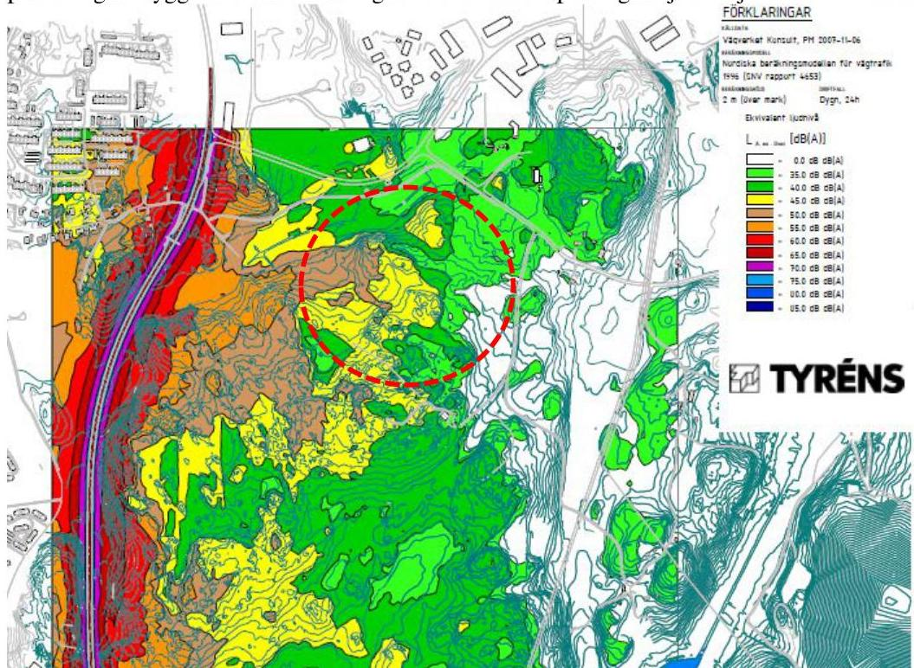(img-21.jpeg)

Trafikbullerutredning för Arningevägen. Tyréns AB 2011. Planområdets läge för bebyggelse markerat med röd linje.

Arbetsmaterial
30

---

KAPITEL
1

# 9.4 Magnetfält

En 20 kV luftburen kraftledning korsar Kristinebergsområdet, sydost om planområdet. Denna kommer på sikt att ersättas med en jordkabel, för att frigöra yta för fler bostäder. I dag finns inga gränsvärden för kraftfrekventa magnetfält, tillsvidare gäller försiktighetsprincipen och skyddsavstånd som uppfyller riktvärdet om högst 0,4 µT. Under en 20 kV-ledning ligger magnetfältet på ca 1-2 µT. Enligt underhandskontakt med Elverket Vallentuna som är huvudman för ledningen uppnås gränsvärdet 0,4 µT på ett skyddsavstånd om ca 10-20 m, vilket därmed uppfylls enligt planförslaget.

# 9.5 Radon

Förekomsten av yngre granit i området innebär risk för höga radonhalter i marken, vilket måste beaktas vid bygglovprövningen. Radonskyddande åtgärder bör ske vid grundläggning inom planområdet för att höga radonhalter ska undvikas. Byggnation ska ske på ett radonsäkert sätt.

# 9.6 Radar

Planområdet ligger inom influensområde för väderradar. På plankartan finns därför en generell begränsning för totalhöjd på högst 20 meter.

# 10. Administrativa bestämmelser

Detaljplanen har en genomförandetid på 15 år från den dag detaljplanen vunnit laga kraft.

# 11. Miljökonsekvenser

Till planprogrammet för Kristineberg hör en miljökonsekvensbeskrivning (MKB), daterad 2014-08-29 (Sweco, 2014). De aspekter MKB:n behandlar är vattenkvalitet, konsekvenser av trafiken, landskapsbild, naturmiljö/rekreation och kulturmiljö.

Denna detaljplaneetapp har inte bedömts innebära risk för betydande miljöpåverkan, varför en separat MKB för denna detaljplan inte tagits fram. Nedan sammanfattas slutsatser från planprogrammets MKB som är relevanta för detta planområde, kompletterat med slutsatser från utredningar gjords specifikt för denna detaljplan (dagvatten och naturmiljöinventering).

## Vattenkvalitet

Arbetsmaterial
31

---

KAPITEL
1

I och med genomförande av planen bedöms konsekvenserna för vattenkvaliteten bli små till märkbart negativa. Dagvattenflöden och föroreningar i dagvattnet kommer att öka efter exploatering och fördröjning och rening erforderas. I och med att skogsmark exploateras kommer mer föroreningar att genereras och nå recipienten. Om god dagvattenhantering tillämpas kan påverkan minskas markant.

## Konsekvenser av trafiken

Förslaget bedöms sammantaget innebära små negativa konsekvenser med avseende på buller, risk från transporter med farligt gods och luftkvaliteten i området. Bullernivåerna och luftföroreningarna i området kommer att öka, eftersom Arningevägen eventuellt kommer att breddas i framtiden och bli mer trafikerad samt att trafiken inom området i sig ökar. Antalet transporter med farligt gods beräknas inte öka nämnvärt, dock innebär förslaget att antalet skyddssubjekt ökar i området.

## Buller

Programområdets läge längs med Arningevägen innebär att området utsätts för höga bullernivåer, särskilt etapperna invid Arningevägen. En bullerutredning finns framtagen (Tyréns AB, 2011) för Arningevägen genom vilken det kan konstateras att gällande riktvärden inte bedöms överskridas för bebyggelse inom etapp 1.

## Luftkvalité

Eftersom Arningevägen kan komma att breddas för mer trafik, innebär detta negativ påverkan på luftkvaliteten i området. Även den ökade trafiken inom utbyggnadsområdet bedöms ha denna påverkan. Fler människor kommer att vistas i området och kommer därmed påverkas av luftföroreningar från motorfordon och vägar i området. Den naturmiljö och bebyggelsestruktur planförslaget innebär kan dock avskärma och minska denna påverkan. Beroende på hur områdets topografi utnyttjas kan konsekvenserna för luftkvaliteten variera. Sammantaget bedöms konsekvenserna för planförslaget på luftkvaliteten bli små. Inga miljökvalitetsnormer för luft bedöms riskera att överskridas med anledning av utbyggnadsförslaget.

## Landskapsbild

Området kommer att förändras från ett naturlandskap till ett bostadsområde med lokaler för verksamheter och förskola. Områdets övergripande gestaltning och struktur tar fasta i de naturvärden som platsen erbjuder och som beskrivits i kommunens översiktsplan och miljöpolicy samt naturvärdesinventeringen. Gröna korridorer bryter igenom strukturen och knyter samman gröna rum och parkmiljöer med den centrala naturvärdeskärnan i södra delen av planområdet. Områdets struktur har anpassats till den befintliga topografin och de högsta punkterna lämnas obebyggda. Exploateringen kommer dock att ge området ny karaktär och nya upplevelser. Påverkan på landskapsbilden är storskalig och permanent.

Arbetsmaterial
32

---

KAPITEL
1

Konsekvenserna på landskapsbilden har bedömts både betraktat inom området och sett utifrån på området. Trots att påverkan blir stor har konsekvenserna bedömts bli begränsade. Detta då området har relativt låg känslighet och det är ett begränsat antal människor som berörs. Konsekvenserna för landskapsbilden utifrån sett bedöms bli små då området knappt kommer att synas från omgivningen.

# Naturmiljö

Området är en del av Angarnkilen, en regionalt utpekad grön kil. Området består idag av obebyggd skogsmark och tillgången till bostadsnära natur riskerar att försämras för befintliga bostäder i samband med den nya bebyggelsen.

I MKB: n för planprogrammet bedömdes förslaget medföra märkbart negativa konsekvenser för naturmiljö och små negativa konsekvenser för rekreationsvärden. De våtmarker som finns i området idag kommer förmodligen att till stor del försvinna vid en exploatering. Inom aktuellt planområde kommer befintligt dike och våtmark bevaras och utvecklas för hantering av dagvattenflöden.

Ett genomförande av planprogrammet bedömdes medföra att framför allt brukad skogsmark tas i anspråk för bostadsbebyggelse, medan hällmarkstallskog i stor utsträckning bevaras i områdets grönstruktur. Kristinebergsområdets rekreationsvärden kommer till stor del att kunna bevaras, genom att breda skogsstråk bevaras mellan utbyggnadsetapperna. Dock påverkas områdets värde som väl uppvuxen skog negativt och den upplevelse som är knuten till dessa värden kommer inte att kvarstå på samma sätt som idag.

Då programförslaget bedömdes medföra konsekvenser för naturmiljön, har en naturvärdesinventering tagits fram (Sweco, 2015).

Vid exploatering av detaljplaneområde 1 påverkas främst den nordliga delen av naturvärdesobjekt 1 där huvudgatan skär igenom för att skapa goda siktförhållanden och svängradie.

Arbetsmaterial
33

---

KAPITEL
1

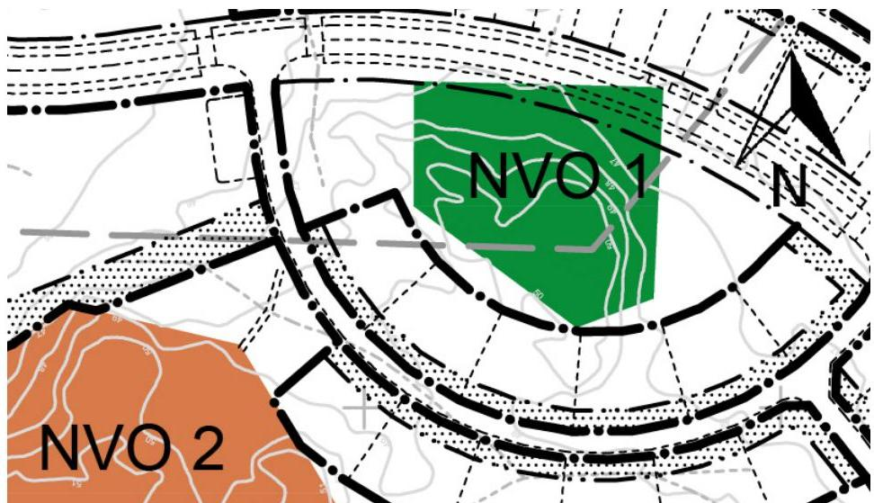(img-22.jpeg)
Föreslagen bebyggelse i relation till avgränsningen för naturvärdesobjekt 1.

Planförslaget innebär att ett naturområde definieras i planstrukturen, så att de flesta värdeträden inom naturvärdesobjekt 1 bevaras och därmed begränsas de negativa konsekvenserna. På plankartan införs bestämmelse NATUR2 på naturmark med naturvärdesområde, som innebär att skog inte får avverkas men att skötsel och gallring får ske. Naturområdena kommer att ingå i kommunens ordinarie "Skötselplan för tätortsnära natur". Kompensationsåtgärder för påverkan på naturvärdesobjekt 1 ska utredas i det fortsatta planarbetet.

## Kulturmiljö

I MKB:n för planprogrammet bedömdes förslaget medföra små märkbart negativa konsekvenser för kulturmiljön, eftersom områdets värden bedöms vara av kommunalt och lokalt värde och det antas finnas fornlämningar i området som kommer att påverkas. Dock kan påverkan på värdena bli begränsade i omfattning, främst beroende på vad för okända lämningar som skulle påverkas.

Inom etapp 1 har inga fornlämningar påträffats vid genomförd arkeologisk utredning (2007) varför denna detaljplan inte bedöms påverka kulturmiljön i någon större omfattning.

## 12. Medverkande tjänstemän

I planarbetet har följande personer medverkat; Martin Larsson projektledare (konsult), Anna Nilsson planarkitekt (konsult), Camilla Petersson exploateringsingenjör, Lovisa Lagerblad miljöplanerare (konsult), Anders Dagsberg landskapsarkitekt, Katharina Staflund trafikplanerare, Christian Hillberg projektledare väg (konsult) och Christina

Arbetsmaterial
34

---

KAPITEL
1

Vendel Roslagsvatten AB VA-ingenjör. Planeringsunderlaget och bildmaterial har tagits fram av Sweco Architects AB.

Vallentuna samhällsbyggnadsförvaltning.

Daniel Jarl
Anna Nilsson

Planeringschef
Planarkitekt, konsult

Arbetsmaterial
35

---

KAPITEL
2

# Genomförandebeskrivning

## FAKTA
### Genomförandebeskrivning

Genomförandebeskrivningen redovisar de organisatoriska, fastighetsrättsliga, tekniska och ekonomiska åtgärder som behövs för ett ändamålsenligt och i övrigt samordnat plangenomförande.

Genomförandebeskrivningen har inte någon självständig rättsverkan utan ska fungera som vägledning till de olika genomförandeåtgärderna. Avgörande frågor som rör fastighetsbildning, vatten- och avloppsanläggningar (VA), vägar m.m. regleras genom respektive speciallag.

# 1. ORGANISATORISKA FRÅGOR

## 1.1 Tidplan

Samråd om detaljplaneförslaget sker under hösten 2015. Granskning av planförslaget beräknas ske 2:a kvartalet 2016 och antagande 4:e kvartalet 2016.

Detaljplanen upprättas med ett normalt planförfarande enligt PBL 2010:900.

## 1.2 Genomförandetid

Detaljplanen har en genomförandetid på 15 år från den dag detaljplanen vunnit laga kraft. Efter genomförandetiden fortsätter detaljplanen att gälla och ge byggrätt som tidigare tills kommunen ändrar eller upphäver detaljplanen.

## 1.3 Ansvarsfördelning, huvudmannaskap

Kommunen är huvudman för allmän plats (GATA, NATUR och PARK). Kommunalt huvudmannaskap innebär att kommunen svarar för genomförande av detaljplanen och den framtida driften inom allmän plats. Trafikverket är huvudman för Arningevägens vägområde.

Vallentunavatten AB (och Roslagsvatten) är huvudman för allmänna vatten-, spillvatten- och dagvattenanläggningar inom verksamhetsområdet för allmänt VA. Planområdet ska ansluta till det allmänna nätet för VA. När planområdet efter

Arbetsmaterial

---

KAPITEL
2

utbyggnad hamnar inom verksamhetsområde för allmänt VA ansvarar Vallentuna-vatten AB för dessa anläggningar fram till respektive förbindelsepunkt och för nätets framtida drift.

Eon har fjärrvärmeledning inom planområdet och ansvarar för utförande och drift. Nya ledningar ska förläggas i delar av områdets nya gatunät.

Huvudman för telenätet i närområdet är Skanova.

Huvudman för elnätet är Elverket Vallentuna AB.

Då detaljplanen vinner laga kraft äger Vallentuna kommun all mark inom planområdet, även kvartersmark. De ingående kvarteren inom planområdet kommer efter att detaljplanen vunnit laga kraft att säljas till olika byggherrar som då kommer att ansvara för genomförandet av detaljplanen inom kvartersmark. Kvartersmark avsedd för förskola ansvarar Vallentuna kommunen för att bebygga i enlighet med detaljplanen.

## 1.4 Avtal

Vallentuna kommun, Prästlönetillgångar i Stockholms stift och JM AB har tecknat ett ramavtal om planering och utbyggnad av Kristinebergsområdet. Avtalet syftar till att fastställa fördelningen av kostnaderna för exploatering av området.

Vallentuna kommun avser att teckna markanvisningsavtal med olika byggherrar för de kvarter inom planområdet som är planlagt för bostadsändamål. När detaljplanen vunnit laga kraft genomförs köp och byggherrarna kan tillträda kvarteren.

## 2. FASTIGHETSRÄTTSLIGA FRÅGOR

### 2.1 Fastighetsbildning, gemensamhetsanläggning mm.

För att kunna genomföra detaljplanen kommer ett antal lantmäteriförrättningar sökas hos Lantmäteriet i Stockholms län.

Vallentuna kommun ansvarar för att upprätta ansökan om fastighetsbildning för att bilda egna självständiga fastigheter för de ingående kvarteren innan försäljning genomförs.

Arbetsmaterial

---

KAPITEL
2

Gatan som förbinder Påtåker med Kristineberg ligger idag inom mark som är privatägd, denna planeras att genom fastighetsreglering överföras till den kommunala fastigheten Mörby 1:297.

# 3. EKONOMISKA FRÅGOR

## 3.1 Planekonomi

Vallentuna kommun som är markägare står för kostnaderna för framtagandet av detaljplanen.

## 3.2 Gatukostnader

Vallentuna kommun ansvarar för och bekostar utbyggnad av allmänna platser inom planområdet.

Huvudgatan med tillhörande cirkulationsplats inom etapp 2 och genomgående gång- och cykelvägar som betjänar allmänheten och övriga boende inom Kristineberg finansieras gemensamt av samtliga tre markägare enligt särskilt avtal.

## 3.3 Anläggningsavgift för VA

Vid genomförandet av detaljplanen kommer fastighetsägarna inom planområdet att anslutas till allmänt verksamhetsområde för VA. Fastighetsägare ska betala ersättning till Vallentuna vatten AB (Roslagsvatten AB) för dennes del i de allmänna VA-huvudanläggningarna i enlighet med Vallentuna kommuns gällande VA-taxa.

# 4. TEKNISKA FRÅGOR

## 4.1 Vatten &amp; avlopp

Utbyggnaden av huvudgatan kommer att ske samordnat med utbyggnaden av en ny huvudledning för vatten och avlopp genom planområdet. Detaljplanen möjliggör att området efter utbyggnad kommer att ingå i verksamhetsområdet för VA.

## 4.2 Dagvatten

En dagvattenutredning finns framtagen för programområdet Kristineberg och detaljplan 1 (Sweco, 2015). Dagvattenflöden och föroreningar i dagvattnet kommer att

Arbetsmaterial

---

KAPITEL
2

öka efter exploatering och fördröjning och rening krävs. För att fördröja och rena dagvattnet föreslås torra översvämningsytor och dagvattendammar kombinerat med LOD-lösningar på kvartersmark, på allmän plats och i gaturum. I samband med detaljprojektering av området ska åtgärder för lokalt omhändertagande av dagvatten utformas och dimensioneras i samråd med Roslagsvatten.

Varje fastighetsägare och verksamhetsutövare har ett ansvar att hantera dagvatten med försiktighet så att miljö och omkringliggande fastigheter inte skadas. Kommunen har ett ansvar som VA-huvudman (Vallentuna Vatten AB) att leda bort dagvatten från samlad bostadsbebyggelse. Fastighetsägare och verksamhetsutövare är ansvariga för dagvattenhanteringen på egen fastighet. Exploaterare ansvarar för avledande av dagvatten inom kvartersmark fram till förbindelsepunkt.

I norra delen av planområdet, utmed befintligt dike, planeras för en permanent dagvattendamm som dimensioneras för fördröjning av ett 20-årsregn. Den reducerade anslutande arean från området är ca 10,4 ha. Strax öster om denna, i anslutning till Högdalvägen placeras en översvämningsyta. Den reducerade anslutande arean från området är ca 3 ha.

## 4.3 Bullerutredning

En trafikbullerutredning för Arningevägen togs fram 2011-04-27 av Tyréns AB. Bebyggelsen inom etapp 1 ligger inom de rekommenderade värdena för buller.

## 4.4 Geoteknik

För detaljplaneområdet har en geoteknisk utredning tagits fram 1982:4. Planområdet består planområdet till största del av berg och morän med sand i de lägre delarna längs Gammeläng. Bebyggelsen planeras till de högre delarna av området medan de sankare delarna planeras för natur och dagvattenhantering.

Fördjupade geotekniska undersökningar kommer att tas fram till granskningsskedet.

## 4.5 Gator

Utbyggnad av områdets huvudgata och resterande gatunät kommer att ske samordnat tillsammans med utbyggnaden för vatten och avlopp.

Samtliga gator planläggs med kommunalt huvudmannaskap.

MEDVERKANDE TJÄNSTEMÄN

Arbetsmaterial

---

KAPITEL
2

I planarbetet har följande personer medverkat; Martin Larsson projektledare (konsult), Anna Nilsson planarkitekt (konsult), Camilla Petersson exploateringsingenjör, Lovisa Lagerblad miljöplanerare (konsult), Anders Dagsberg landskapsarkitekt, Katharina Staflund trafikplanerare, Christian Hillberg projektledare väg (konsult) och Christina Vendel Roslagsvatten AB VA-ingenjör. Planeringsunderlaget och bildmaterial har tagits fram av Sweco Architects AB.

Vallentuna samhällsbyggnadsförvaltning

Sven Strand
Martin Larsson

Exploaterings- och infrastrukturchef
Exploateringsingenjör, konsult

Arbetsmaterial
40